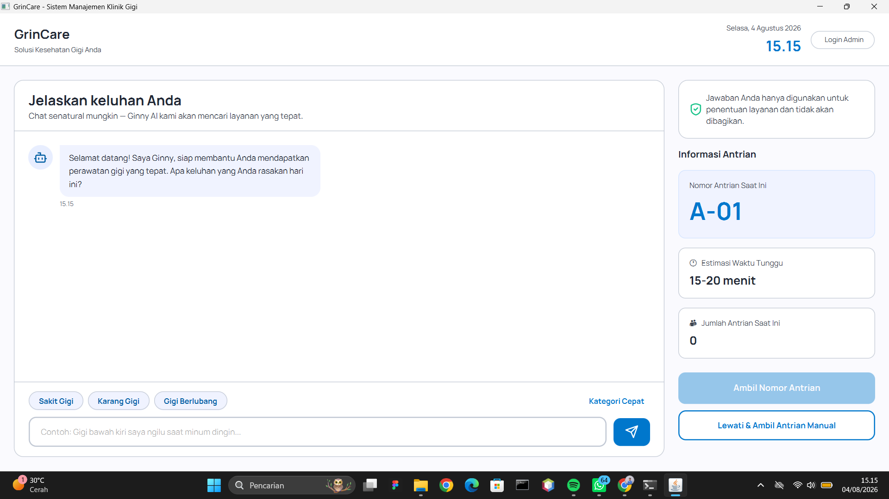
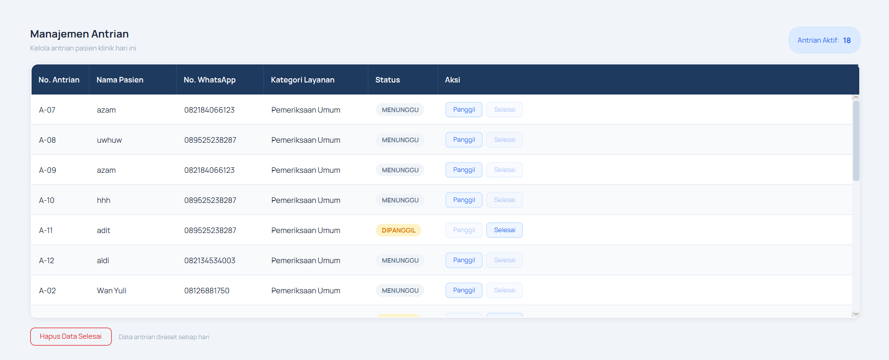
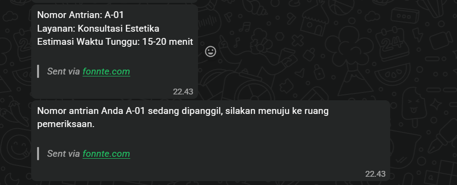

# GrinCare

Sistem Manajemen Operasional Klinik Gigi Berbasis AI

GrinCare merupakan aplikasi desktop berbasis JavaFX yang dirancang untuk membantu operasional klinik gigi melalui konsultasi awal berbasis kecerdasan buatan (AI), pengelolaan antrean pasien, pengiriman tiket digital melalui WhatsApp, serta dashboard administrasi untuk mendukung pelayanan klinik yang lebih efisien.

Aplikasi ini menerapkan arsitektur **Model-View-Controller (MVC)** dengan pemisahan lapisan **Service** dan **Repository**. Seluruh data aplikasi disimpan secara lokal menggunakan file XML, sedangkan layanan AI memanfaatkan **Google Gemini API** dan **Fonnte WhatsApp API**.

---

## Fitur

### Kiosk Pasien

- Konsultasi awal menggunakan Google Gemini AI.
- Kategori Cepat berbasis struktur Tree.
- Rekomendasi layanan cadangan berbasis Graph apabila AI tidak tersedia.
- Pengambilan nomor antrean otomatis.
- Pengiriman tiket digital melalui WhatsApp.
- Informasi antrean secara real-time.

### Dashboard Admin

- Login administrator.
- Pengelolaan antrean pasien.
- Pemanggilan pasien.
- Penyelesaian antrean.
- Dashboard statistik.
- Pengelolaan kategori layanan.
- Pengelolaan keyword AI.

---

# Tampilan Aplikasi

## Dashboard Konsultasi

Pasien melakukan konsultasi awal dengan Ginny AI untuk memperoleh rekomendasi layanan sebelum mengambil nomor antrean.

<p align="center">
  
</p>

---

## Dashboard Antrean

Administrator dapat mengelola antrean pasien, memanggil pasien, serta menyelesaikan antrean secara langsung melalui dashboard.

<p align="center">
  
</p>

---

## Tiket Antrean WhatsApp

Setelah nomor antrean berhasil dibuat, sistem secara otomatis mengirimkan tiket digital melalui WhatsApp menggunakan Fonnte API.

<p align="center">
  
</p>

---

## Teknologi yang Digunakan

| Kategori | Teknologi |
|----------|-----------|
| Bahasa Pemrograman | Java |
| Framework UI | JavaFX |
| Desain UI | FXML |
| Artificial Intelligence | Google Gemini API |
| WhatsApp Gateway | Fonnte API |
| Penyimpanan Data | XML |

---

## Arsitektur Sistem

```
JavaFX (FXML)
      │
 Controller
      │
   Service
      │
 Repository
      │
 XML Storage
```

---

## Struktur Data

| Struktur Data | Fungsi |
|---------------|--------|
| Queue (LinkedList) | Mengelola antrean pasien |
| Tree | Kategori Cepat |
| Graph | Rekomendasi layanan cadangan |
| ArrayList | Penyimpanan sementara hasil parsing XML |

---

## Cara Menjalankan Proyek

### Persyaratan

- Java Development Kit (JDK)
- JavaFX SDK
- IDE (NetBeans / IntelliJ IDEA / VS Code)
- Google Gemini API Key
- Fonnte API Token

### Instalasi

Clone repository.

```bash
git clone https://github.com/username/grincare.git
```

Buka project menggunakan IDE.

Konfigurasikan:

- Google Gemini API Key
- Fonnte API Token

Pastikan JavaFX SDK telah terpasang, kemudian jalankan kelas `Main`.

---

## Struktur Proyek

```
src/
├── controller/
├── model/
├── repository/
├── service/
├── util/
└── resources/
```

---

## Tim Pengembang

Team BebasKataLala

- Afwan Aditya Saputra
- Ahmad Dani Maulana
- Muhammad Pramudya Aldiansyah
- Khalisa Zahra Yulismar

---

## Lisensi

Proyek ini dikembangkan untuk keperluan akademik pada mata kuliah **Fundamen Pengembangan Aplikasi, Algoritma dan Struktur Data, Dan Rekayasa Perangkat Lunak**, Program Studi Informatika, Universitas Islam Indonesia.
